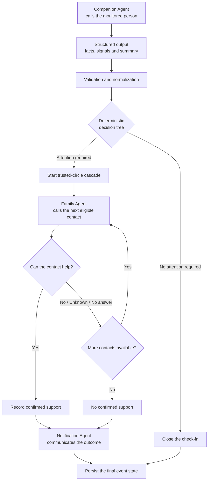
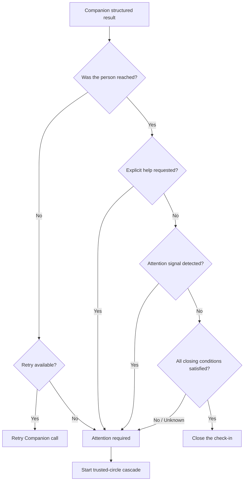
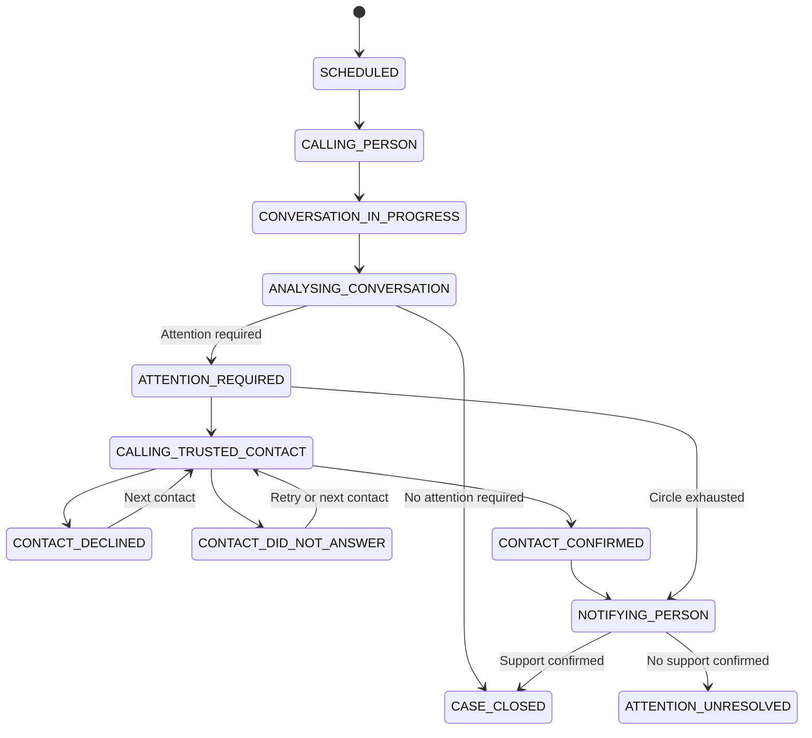
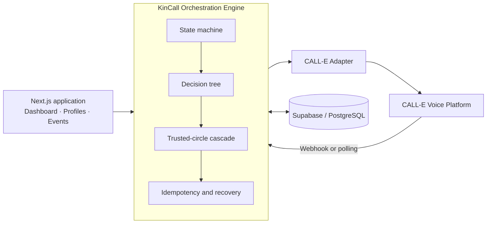

<p align="center">
  
</p>

<h1 align="center">KinCall</h1>

<p align="center">
  <strong>Agent-powered phone check-ins with deterministic trusted-circle orchestration.</strong>
</p>

<p align="center">
  
  
  
  
  
  
</p>

<p align="center">
  Built for <strong>CALL-E: Your Code Is Calling</strong>.
</p>

---

## Overview

KinCall is an agent-powered phone check-in and coordination system designed for people who may benefit from regular contact.

Specialized voice agents conduct natural conversations and return structured outputs. A deterministic orchestration engine then follows an explicit decision tree to close the check-in, activate the trusted-circle cascade, or report that no support was confirmed.

> **Agents understand the conversation. The orchestration engine decides what happens next.**

KinCall is not a medical device or an emergency service. It does not diagnose, perform medical triage, or contact emergency services.

---

## The problem

A regular phone call can reveal that someone needs help, but the main challenge begins after the conversation.

Someone still needs to:

- understand what was actually said;
- decide whether human attention is required;
- identify the right trusted contact;
- communicate the context clearly;
- avoid duplicate or inconsistent actions;
- inform the monitored person of the final outcome;
- maintain an accessible history of the event.

KinCall turns that coordination process into a structured, deterministic and recoverable agent workflow.

---

## How it works

1. A **Companion Agent** calls the monitored person.
2. The conversation is transformed into a factual structured output.
3. The **Orchestration Engine** validates and normalizes the result.
4. A deterministic **decision tree** selects the next workflow action.
5. When attention is required, **Family Agents** contact the trusted circle sequentially.
6. The cascade stops when a contact confirms they can help or the circle is exhausted.
7. A **Notification Agent** calls the monitored person back with the outcome.
8. The complete event is persisted and displayed in the dashboard.



---

## Agent architecture

KinCall uses specialized agents with clearly separated responsibilities.

| Component | Responsibility |
|---|---|
| **Companion Agent** | Conducts the initial check-in and extracts a factual structured result from the conversation. |
| **Family Agent** | Contacts one trusted-circle member and asks whether they can help with the specific situation. |
| **Notification Agent** | Calls the monitored person back to communicate the confirmed or unresolved outcome. |
| **Orchestration Engine** | Applies the decision tree, controls transitions, selects contacts, handles retries and guarantees workflow consistency. |

The agents interpret natural-language conversations, but they do not control the workflow.

They cannot independently:

- select the next trusted contact;
- change retry limits;
- close an event;
- skip the cascade;
- alter a terminal outcome;
- create additional calls.

Those decisions remain inside the deterministic orchestration layer.

---

## From conversation to decision

The Companion Agent converts natural language into a validated structured result.

For example:

```json
{
  "person_reached": "yes",
  "explicit_help_requested": "yes",
  "neutral_summary": "Claire would like help completing an administrative document."
}
```

The orchestration engine then applies an explicit business rule:

```text
explicit_help_requested = yes
            │
            ▼
    ATTENTION_REQUIRED
            │
            ▼
Start trusted-circle cascade
```

The AI model interprets the conversation.

The decision tree determines the operational action.

This separation makes the workflow:

- predictable;
- reproducible;
- testable;
- observable;
- auditable;
- independent from model variability.

---

## Trusted-circle orchestration

When attention is required, KinCall activates a controlled sequential cascade.

```text
Julie
  │
  ├── Confirms support
  │         │
  │         ▼
  │    Stop cascade
  │
  └── Declines / no answer
                    │
                    ▼
                  Marc
                    │
                    ├── Confirms support
                    │         │
                    │         ▼
                    │    Stop cascade
                    │
                    └── Declines / no answer
                                      │
                                      ▼
                                  Next contact
```

The orchestration engine manages:

- contact priority;
- availability windows;
- consent status;
- active call attempts;
- bounded retries;
- confirmed commitments;
- unresolved outcomes;
- notification callbacks;
- idempotency;
- crash recovery.

Only one trusted contact is called at a time.

---

## Context propagation

KinCall preserves the factual context of the initial conversation throughout the workflow.

For example:

```text
Monitored person:

“I need help completing an administrative document.”
```

The Family Agent receives:

```text
“Claire told KinCall that she would like help completing
an administrative document.”
```

The context is not reduced to a generic message such as:

```text
“Claire needs help.”
```

The same factual context is reused for every contact involved in the event.

No use case is hardcoded. The contextual brief is generated from the validated structured output and can represent administrative, practical or previously unseen situations.

---

## Decision tree

The decision layer is deterministic and model-independent.

A simplified Companion decision tree looks like this:



A language model never directly decides to call Julie, Marc or another contact.

It only returns structured facts that the engine evaluates.

---

## Event state machine

The orchestration engine progresses through explicit event states.



The outcome notification is part of the workflow and occurs before the event reaches its terminal state.

---

## Core features

| Feature | Description |
|---|---|
| **Specialized voice agents** | Companion, Family and Notification agents handle separate stages of the phone workflow. |
| **Structured outputs** | Natural conversations are converted into validated facts, signals and neutral summaries. |
| **Deterministic decision tree** | Explicit business rules control every operational decision. |
| **Trusted-circle cascade** | Contacts are called sequentially until support is confirmed or the circle is exhausted. |
| **Context-aware Family Agents** | Every contact receives the relevant factual context from the original check-in. |
| **Availability-aware ordering** | Contact availability may influence call order without permanently excluding anyone. |
| **Bounded retries** | Retry limits are explicit, persisted and consistently enforced. |
| **Outcome notification** | The monitored person receives one final informational call after the cascade. |
| **Intervention summaries** | KinCall records who committed, what they intend to do and when, when available. |
| **Unresolved outcomes** | Exhausted cascades end visibly as **No confirmed support**. |
| **Event timeline** | Calls, transitions and outcomes are recorded chronologically. |
| **Operational dashboard** | Profiles, check-ins, activity metrics and event history are available from one interface. |
| **Idempotent orchestration** | Duplicate webhooks, polls or workers cannot intentionally create duplicate workflow actions. |
| **Crash recovery** | Durable operation records allow interrupted workflows to resume safely. |
| **Accessibility foundations** | Keyboard controls, semantic markup, visible focus and reduced-motion support. |

> [!NOTE]
> Schedule preferences and next planned check-ins are already calculated and displayed. Automatic production scheduling is not implemented yet.

---

## System architecture

KinCall follows an event-driven architecture built around a deterministic state machine.



### Separation of understanding and decision-making

```text
Voice conversation
        │
        ▼
AI interpretation
        │
        ▼
Structured output
        │
        ▼
Validation and normalization
        │
        ▼
Deterministic decision tree
        │
        ▼
Orchestrated action
```

### Durable call intents

Every outbound call is persisted as an intent before the external request is sent.

This prevents a process interruption from leaving an external call that KinCall cannot recover or identify.

### Idempotent operations

Each orchestration step uses a stable operation key.

Replaying the same webhook, poll or worker operation becomes a no-op instead of creating a second action.

### Processing leases

Call results are processed under time-bounded leases so that multiple workers cannot advance the same workflow simultaneously.

---

## Technology stack

| Layer | Technology |
|---|---|
| Frontend | Next.js 16, React 19 |
| Language | TypeScript 5 |
| Styling | Tailwind CSS v4 |
| Orchestration | Deterministic state machine and decision tree |
| Voice agents | CALL-E REST API |
| Database | Supabase / PostgreSQL |
| Validation | Runtime schemas and normalized structured outputs |
| Testing | Vitest |
| Runtime | Node.js `^20.9.0 \|\| >=22.0.0` |

---

## Project structure

```text
app/
├── (marketing)/        Landing page
├── (app)/              Dashboard, profiles, history and event pages
├── api/                Event, webhook, polling and profile routes
└── ui/                 Shared UI components and KinCall branding

lib/
├── orchestration/      Engine, state machine, decision tree and cascade logic
├── calle/              CALL-E adapter and structured-result schemas
├── database/           Repository interface and persistence drivers
├── presentation/       Human-readable labels, briefs and summaries
├── schedule/           Next-check-in calculations
├── dashboard/          Operational metrics and aggregations
└── observability/      Non-sensitive timing diagnostics

prompts/
├── companion-agent.ts
├── family-agent.ts
└── person-notification-agent.ts

supabase/migrations/     PostgreSQL schema and incremental migrations
tests/                   Automated regression and orchestration tests
docs/                    Architecture, specification and decision records
```

---

## Getting started

### Prerequisites

- Node.js `^20.9.0 || >=22.0.0`
- npm
- A Supabase project
- A CALL-E account for real voice calls

### Installation

```bash
git clone <your-repository-url>
cd kincall

npm install
cp .env.example .env.local
npm run dev
```

Open:

```text
http://localhost:3000
```

### Database setup

Configure Supabase in `.env.local`, then run:

```bash
npx supabase link --project-ref <your-project-ref>
npx supabase migration list
npx supabase db push --dry-run
npx supabase db push
```

---

## Environment variables

Never commit `.env.local`, API keys, service-role credentials or real phone numbers.

| Variable | Purpose |
|---|---|
| `KINCALL_PERSISTENCE` | Selects the persistence driver. |
| `SUPABASE_URL` | Supabase project URL. |
| `SUPABASE_SERVICE_ROLE_KEY` | Server-side Supabase service-role key. |
| `CALLE_MODE` | Selects the CALL-E adapter. Real calls require `live`. |
| `CALLE_API_KEY` | CALL-E API key. |
| `CALLE_BASE_URL` | CALL-E API endpoint. |
| `CALLE_WEBHOOK_URL` | Public URL used to receive asynchronous call results. |
| `CALLE_WEBHOOK_SECRET` | Secret used to verify incoming webhook signatures. |
| `KINCALL_PROCESSING_LEASE_SECONDS` | Duration of orchestration processing leases. |
| `KINCALL_TIMING` | Enables non-sensitive timing logs when set to `1`. |

See `.env.example` for the complete configuration template.

---

## Quality and testing

```bash
npm run typecheck
npm test
npm run build
```

The project currently includes **925 passing automated tests** across 62 test files.

The suite covers:

- decision-tree rules;
- state-machine transitions;
- agent structured-output validation;
- trusted-circle contact ordering;
- availability handling;
- retry policies;
- context propagation;
- informational callbacks;
- event idempotency;
- duplicate webhook and polling processing;
- crash recovery;
- concurrent workers;
- consent and archival rules;
- scheduling calculations;
- dashboard and presentation logic.

The suite provides extensive regression coverage but is not a formal proof of correctness.

---

## Safety and limitations

- **Not an emergency service.** KinCall never contacts emergency services.
- **No medical diagnosis.** Agents do not diagnose conditions or perform medical triage.
- **No verified intervention completion.** A contact confirmation is a recorded commitment, not proof that the action occurred.
- **No automatic scheduler yet.** Schedule preferences are stored, but check-ins are currently initiated manually.
- **External call latency.** Ringing time depends on CALL-E and the telephone carrier.
- **Limited voicemail detection.** The platform cannot reliably distinguish a live person from an answering machine.
- **Authentication required before public deployment.** Mutating API routes still require access control and rate limiting.
- **Compliance review required.** Privacy, retention and operational policies must be reviewed before broader real-world use.

---

## Hackathon status

KinCall is currently being developed and tested as a submission for
[CALL-E: Your Code Is Calling](https://call-e.devpost.com/).

The hackathon version is a functional end-to-end MVP featuring:

- specialized voice agents;
- structured conversational outputs;
- a deterministic decision tree;
- trusted-circle orchestration;
- factual context propagation between agents;
- outcome notification calls;
- persistent event histories;
- idempotency and crash recovery;
- controlled live phone calls.

Development is still ongoing.

Before the final submission, the main remaining work includes:

- completing the final live-call scenarios;
- refining the product experience;
- preparing the demonstration video;
- finalizing the Devpost submission;
- documenting technical and product feedback.

Features required for broader public production use, including authentication, automatic scheduling, compliance review and deployment hardening, remain outside the current hackathon MVP scope.

---

## CALL-E hackathon

KinCall is being built for
[CALL-E: Your Code Is Calling](https://call-e.devpost.com/), an ongoing hackathon focused on functional AI agents that make real phone calls and complete real-world tasks.

The project explores how specialized voice agents can work with a deterministic orchestration engine to coordinate human support around a monitored person.

KinCall is an independent hackathon submission. It is not affiliated with, endorsed by or sponsored by CALL-E.

---

## Documentation

Further technical details are available in:

- [`docs/PRODUCT_SPECIFICATION.md`](docs/PRODUCT_SPECIFICATION.md)
- [`docs/TECHNICAL_ARCHITECTURE.md`](docs/TECHNICAL_ARCHITECTURE.md)
- [`docs/DECISION_LOG.md`](docs/DECISION_LOG.md)

