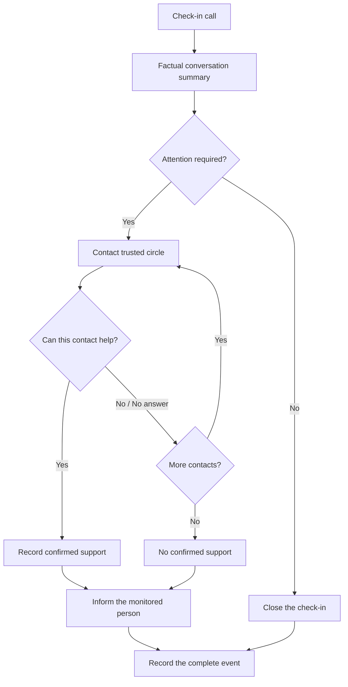
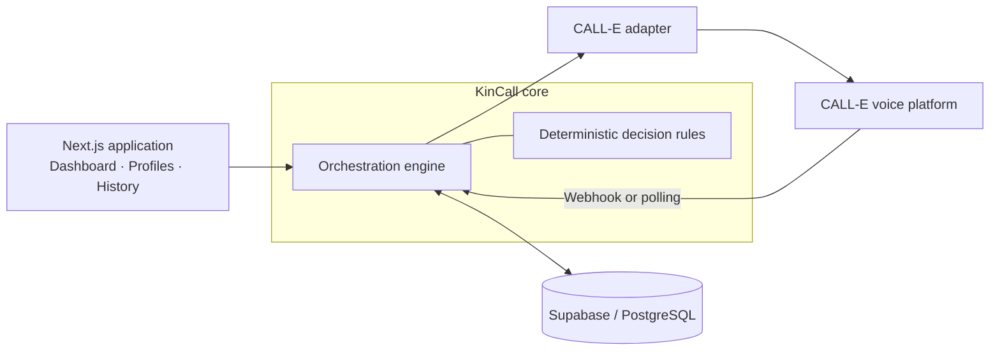

<p align="center">
  
</p>

<h1 align="center">KinCall</h1>

<p align="center">
  <strong>AI-powered phone check-ins and trusted-circle coordination.</strong>
</p>

<p align="center">
  
  
  
  
  
</p>

---

## Overview

KinCall is a phone-based check-in and family coordination system for people who may benefit from regular contact.

It conducts a natural conversation, records a factual summary, applies deterministic attention rules, and contacts the person’s trusted circle when human support may be needed.

KinCall is not a medical device or an emergency service. It does not diagnose, assess medical severity, or contact emergency services.

---

## How it works

1. KinCall calls the monitored person.
2. The conversation is converted into a factual structured summary.
3. Deterministic rules decide whether attention is required.
4. When needed, trusted contacts are called one at a time.
5. The cascade stops when someone confirms they can help, or when the circle is exhausted.
6. KinCall calls the monitored person back with the outcome.
7. The full event is recorded in the dashboard and history.



---

## Core capabilities

| Capability | Description |
|---|---|
| **Telephone check-ins** | CALL-E voice agents conduct natural phone conversations with the monitored person. |
| **Factual context propagation** | The specific context shared during the check-in is passed to every trusted contact involved in the event. |
| **Deterministic attention rules** | Language models structure the conversation, while application rules determine what happens next. |
| **Trusted-circle cascade** | Contacts are called sequentially until one confirms they can help or the circle is exhausted. |
| **Bounded retries** | Retry limits are explicit, persisted and enforced consistently. |
| **Availability-aware ordering** | Contact availability may change who is called first, but never delays the cascade or permanently excludes someone. |
| **Informational callback** | After the cascade, KinCall calls the monitored person once to communicate the outcome. |
| **Intervention summaries** | Confirmed commitments are displayed with the contact, intended action and estimated timing when available. |
| **No confirmed support state** | Events remain visibly unresolved when nobody confirms they can help. |
| **Profiles and trusted circles** | Each profile includes contact preferences, schedule configuration and an ordered trusted circle. |
| **Dashboard and history** | Daily summaries, operational metrics, event timelines and historical activity are available in one interface. |
| **Crash-safe orchestration** | Durable call intents, operation keys and processing leases prevent duplicated calls during retries or restarts. |
| **Accessibility foundations** | Semantic controls, keyboard navigation, visible focus and reduced-motion support are built into the interface. |

> [!NOTE]
> Automatic production scheduling is not implemented yet. Schedule preferences are stored and displayed, while check-ins are currently initiated manually.

---

## Architecture

KinCall separates conversational AI from operational decisions.

CALL-E handles phone conversations and produces structured results. A deterministic TypeScript state machine owns event progression, retries, contact selection and terminal outcomes.



Each outbound call is persisted before the external request is sent. Results are processed through idempotent operations and time-bounded leases, allowing interrupted workflows to recover without creating duplicate calls.

---

## Technology stack

| Layer | Technology |
|---|---|
| Web framework | Next.js 16, React 19 |
| Language | TypeScript 5 |
| Styling | Tailwind CSS v4 |
| Database | Supabase / PostgreSQL |
| Voice integration | CALL-E REST API |
| Validation | Runtime schemas and server-side validation |
| Testing | Vitest |
| Runtime | Node.js `^20.9.0 \|\| >=22.0.0` |

---

## Project structure

```text
app/
├── (marketing)/        Landing page
├── (app)/              Dashboard, profiles, contacts, history and events
├── api/                Application and CALL-E API routes
└── ui/                 Shared UI components and KinCall branding

lib/
├── orchestration/      State machine, transitions and decision rules
├── calle/              CALL-E adapters and structured-result schemas
├── database/           Repository interface and persistence drivers
├── presentation/       Human-readable summaries and labels
├── schedule/           Planned check-in calculations
└── dashboard/          Dashboard aggregation helpers

prompts/                 Voice-agent instructions
supabase/migrations/     Database schema and incremental migrations
tests/                   Automated unit and integration-oriented tests
docs/                    Product, architecture and decision documentation
```

---

## Getting started

### Prerequisites

- Node.js `^20.9.0 || >=22.0.0`
- npm
- A Supabase project for persistent storage
- A CALL-E account for real phone calls

### Installation

```bash
git clone <your-repository-url>
cd kincall

npm install
cp .env.example .env.local
npm run dev
```

The application will be available at:

```text
http://localhost:3000
```

### Database setup

Configure the Supabase variables in `.env.local`, then link and migrate the project:

```bash
npx supabase link --project-ref <your-project-ref>
npx supabase migration list
npx supabase db push --dry-run
npx supabase db push
```

---

## Environment variables

Never commit `.env.local`, API keys, database credentials or real phone numbers.

| Variable | Purpose |
|---|---|
| `KINCALL_PERSISTENCE` | Selects the persistence driver. |
| `SUPABASE_URL` | Supabase project URL. |
| `SUPABASE_SERVICE_ROLE_KEY` | Server-side Supabase service-role key. |
| `CALLE_MODE` | Selects the CALL-E adapter. Real calls require `live`. |
| `CALLE_API_KEY` | CALL-E API key. |
| `CALLE_BASE_URL` | CALL-E API endpoint. |
| `CALLE_WEBHOOK_URL` | Public callback URL for asynchronous call results. |
| `CALLE_WEBHOOK_SECRET` | Secret used to verify incoming webhook requests. |
| `KINCALL_PROCESSING_LEASE_SECONDS` | Duration of event-processing leases. |
| `KINCALL_TIMING` | Enables non-sensitive timing diagnostics when set to `1`. |

Refer to `.env.example` for the full configuration template.

---

## Quality checks

```bash
npm run typecheck
npm test
npm run build
```

The automated suite currently contains **925 passing tests** covering:

- state transitions and decision rules;
- trusted-circle ordering and retries;
- contextual information propagation;
- informational callbacks;
- crash recovery and idempotency;
- concurrent event processing;
- contact consent and archival;
- scheduling calculations;
- dashboard and presentation helpers.

The test suite provides broad regression coverage but is not a formal verification of the system.

---

## Safety and limitations

- **Not an emergency service.** KinCall does not contact emergency services.
- **No medical diagnosis.** It does not diagnose conditions or assess medical severity.
- **No verified intervention completion.** A trusted contact’s response is stored as a commitment, not proof that the action occurred.
- **No automatic production scheduler yet.** Schedule preferences are stored, but calls are currently initiated manually.
- **External call latency.** Telephone delivery time depends on CALL-E and the carrier.
- **Limited voicemail detection.** KinCall cannot reliably distinguish a person from an answering machine.
- **Authentication still required.** Mutating routes must be protected before a public live deployment.
- **Compliance review required.** Data-protection and operational policies must be reviewed before broader real-world use.

---

## Project status

KinCall is a functional MVP with persistent profiles, trusted-circle orchestration, controlled live phone calls, dashboard reporting and automated recovery mechanisms.

Before public deployment, the main remaining work includes:

- user authentication and authorization;
- protection and rate limiting for mutating routes;
- automatic scheduling;
- production webhook configuration;
- compliance and privacy review;
- infrastructure and operational hardening.

Further technical details are available in:

- [`docs/PRODUCT_SPECIFICATION.md`](docs/PRODUCT_SPECIFICATION.md)
- [`docs/TECHNICAL_ARCHITECTURE.md`](docs/TECHNICAL_ARCHITECTURE.md)
- [`docs/DECISION_LOG.md`](docs/DECISION_LOG.md)

---

## Origin

KinCall originated during the CALL-E hackathon and has continued as an independent product project.

It is not affiliated with, endorsed by, or sponsored by CALL-E or any other organisation.
