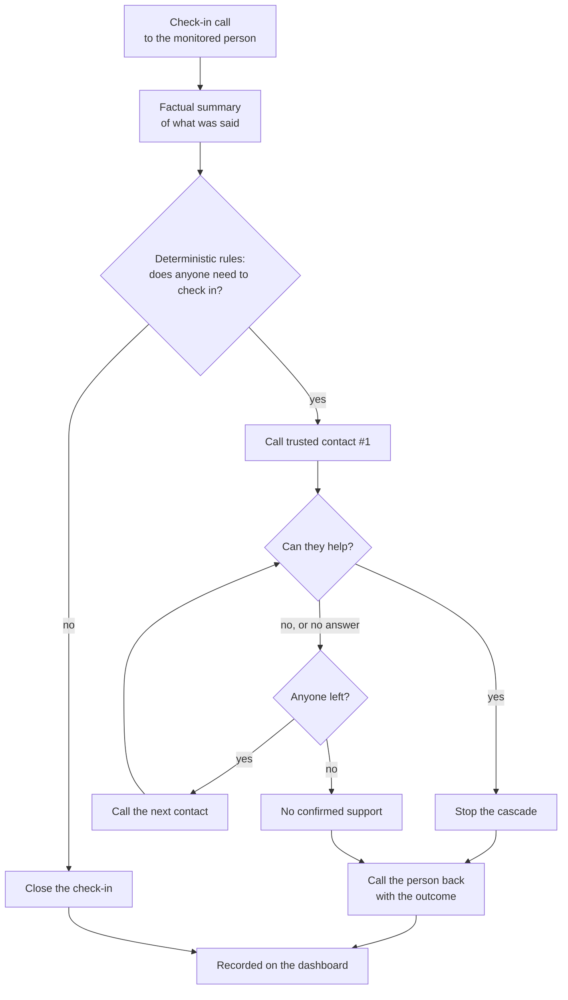
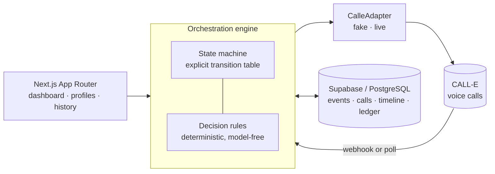

<div align="center">


# KinCall

**A familiar phone call, watching over the people you love.**

KinCall calls someone who lives alone, listens to how they are, and — when something
comes up — reaches their trusted circle until a real person confirms they will help.
Then it calls back to say who is coming.


</div>

---

## Overview

KinCall places a check-in phone call to a monitored person — on a stored schedule, or
started by hand from the dashboard. A voice agent has an ordinary conversation, and
returns a constrained, factual summary of what was said. Deterministic TypeScript rules,
not a model, then decide one of two things: close the check-in, or contact the trusted
circle. If the circle is contacted, KinCall works down it in order, retrying within a
bounded policy, until somebody confirms they can help or the circle is exhausted. Either
way it calls the monitored person back to tell them the outcome, and the whole sequence —
every call, every decision, every skipped contact and why — is recorded on a dashboard
the family can read.

KinCall is **not** a medical device and **not** an emergency service. It never diagnoses,
never rates severity, and never contacts emergency services.

---

## The problem

When someone lives alone, the people who care about them end up improvising a rota of
phone calls. It works until it doesn't: everyone assumes someone else called today, a
worrying remark gets mentioned to one person and not the others, and when something does
come up, the scramble to find whoever is free and nearby starts from scratch — over group
chats, at whatever hour it happens.

The hard part was never the phone call. It is the coordination around it: noticing that
something was said, deciding it warrants a call to the family, working through the circle
in a sensible order, and closing the loop with the person who raised it in the first
place. KinCall does that part, the same way every time, and writes down what it did.

---

## How it works

1. **KinCall calls the monitored person.** A warm, open-ended conversation — never a
   symptom questionnaire.
2. **The conversation is summarized factually.** A constrained result: what was said, plus
   categorical signals, never an interpretation.
3. **Deterministic rules decide.** Whether the trusted circle should be contacted is
   decided in TypeScript from that validated result — an explicit rule order, not a model
   judgement.
4. **The trusted circle is contacted in order**, one contact at a time, each told the same
   factual context, each retried at most once.
5. **Someone confirms, or the circle is exhausted.** A clear commitment stops the cascade;
   running out of contacts is a visible outcome, not a silent one.
6. **KinCall calls the monitored person back** with the result — who is coming and roughly
   when, or that nobody confirmed and they should contact someone themselves.
7. **The dashboard records everything**, with the full timeline of each check-in.



---

## Core features

| | |
|---|---|
| **Two CALL-E modes** | A fake adapter drives the whole flow with no keys and no network; a live adapter places real calls behind the same interface. |
| **Context propagation** | What the person actually said reaches every trusted contact — "help completing an administrative document", not just "asked for help". Generalizes to any situation; no hardcoded list. |
| **Deterministic cascade** | Contacts called in configured order, one at a time, with bounded retries and no model in the decision path. |
| **Retries and availability** | Exactly one retry per contact and one for the monitored person. Availability windows re-order who is tried first; nobody is ever excluded by them. |
| **Primary contact** | At most one per circle, enforced in the database. Informational — it never bypasses consent or retry rules. |
| **Schedules** | Days, time and timezone per person, with the next planned check-in computed and displayed. |
| **Informational callback** | One call back to the monitored person after the outcome — never retried, never able to change the outcome. |
| **Intervention summaries** | Who committed to what and roughly when, always with an explicit "KinCall has not verified this took place" caveat. |
| **Unresolved outcomes** | An exhausted circle ends visibly as *No confirmed support*, never as a silent close and never waiting on a human. |
| **Dashboard, profiles, history** | Daily recap per person, operational metrics, a filterable calendar and per-event timelines. |
| **Supabase persistence** | Full history in PostgreSQL, with row-level security and server-only credentials. |
| **Crash recovery** | An operation ledger, call intents and processing leases: a crash, a duplicate webhook or two workers cannot duplicate a call. |
| **Accessibility** | Keyboard-operable controls, visible focus, semantic markup and reduced-motion support. No formal WCAG audit is claimed. |
| **925 automated tests** | Covering orchestration, crash recovery, concurrency, prompts, presentation and the five fake scenarios. |

> [!NOTE]
> There is **no automatic production scheduler**. Schedules are stored and displayed;
> a check-in is started by hand from a profile page.

---

## Architecture

The orchestration engine is the centre of the system, and it is deliberately boring:
plain TypeScript, an explicit state-transition table, and no model anywhere in the
decision path. CALL-E sits behind an adapter interface, so the same engine drives fake
and live runs identically.



**Result processing.** A live call returns immediately as *queued*; the terminal result
arrives later. In a deployment that is a signed webhook; locally it is a poll endpoint the
event page drives every two seconds. Both run the identical orchestration code.

**Durability.** Every transition is written with an operation key, so a replay is a no-op
rather than a duplicate. Every outbound call is written as an *intent* before the request
leaves, so a crash can never leave a placed call KinCall cannot find. Every terminal
result is processed under a time-bounded lease, so two workers cannot both act on it.

---

## Technology stack

| Layer | Choice |
|---|---|
| Framework | Next.js 16 (App Router), React 19 |
| Language | TypeScript 5, strict |
| Styling | Tailwind CSS v4, CSS-first tokens |
| Database | Supabase (PostgreSQL), RLS forced, service-role only |
| Voice | CALL-E REST API behind a `CalleAdapter` interface |
| Tests | Vitest |
| Runtime | Node `^20.9.0 || >=22.0.0` |

---

## Project structure

```
app/
  (marketing)/        Landing page
  (app)/              Dashboard, profiles, trusted circles, history, events
  api/                Event start, poll, webhook, people and contact routes
  ui/                 Design-system primitives and the KinCall mark
lib/
  orchestration/      State machine, engine, decision rules, context briefs
  calle/              Adapter interface, fake and live adapters, result schemas
  database/           Repository interface, Supabase and in-memory drivers
  presentation/       Human-readable labels and summaries
  schedule/           Deterministic next-check-in computation
prompts/              Companion, Family and notification agent prompts
supabase/migrations/  0001 – 0014
tests/                925 tests
docs/                 Product specification, technical architecture, decision log
```

---

## Getting started

**Prerequisites** — Node `^20.9.0 || >=22.0.0` and npm. No keys are needed for fake mode.

```bash
git clone <your-repository-url>
cd kincall
npm install
cp .env.example .env.local
```

Fake mode is the default, so this already works:

```bash
npm run dev            # http://localhost:3000
```

Open a profile and press **Launch demo** to run a complete check-in — including the
trusted-circle cascade and the callback — with no calls placed and no network used.

**With Supabase** (persistent history). Set `KINCALL_PERSISTENCE=supabase`, `SUPABASE_URL`
and `SUPABASE_SERVICE_ROLE_KEY` in `.env.local`, then apply the schema:

```bash
npx supabase link --project-ref <your-project-ref>
npx supabase migration list        # local and remote should match
npx supabase db push --dry-run     # preview
npx supabase db push               # apply
```

**Checks:**

```bash
npm run typecheck
npm test
npm run build
```

---

## Environment variables

All values below are placeholders. Never commit a real key or a real phone number —
`.env.local` is git-ignored, and `.env.example` is the documented template.

**Fake mode (default)** — nothing is required.

| Variable | Purpose |
|---|---|
| `CALLE_MODE` | `fake` (default) or `live`. Only `live` places real calls. |

**Supabase persistence**

| Variable | Purpose |
|---|---|
| `KINCALL_PERSISTENCE` | `memory` (default) or `supabase`. |
| `SUPABASE_URL` | Project URL. Server-only — never `NEXT_PUBLIC_`. |
| `SUPABASE_SERVICE_ROLE_KEY` | Service-role key. Bypasses RLS; server-only. |
| `KINCALL_PROCESSING_LEASE_SECONDS` | Lease duration; set at or above your platform's function timeout. |

**Live CALL-E**

| Variable | Purpose |
|---|---|
| `CALLE_API_KEY` | API key. Required when `CALLE_MODE=live`. |
| `CALLE_BASE_URL` | API base URL. Defaults to CALL-E's public endpoint. |
| `CALLE_WEBHOOK_URL` | Public HTTPS URL of `/api/webhooks/calle`. Leave unset locally and use the poll route. |
| `CALLE_WEBHOOK_SECRET` | Signing secret used to verify inbound webhooks. |
| `KINCALL_PHONE_<ID>` | Optional per-entity override of a stored number, for redirecting a test run. |

**Seed and tooling only** — not read by the application.

| Variable | Purpose |
|---|---|
| `KINCALL_LIVE_TEST_PHONE` | The single consenting number `scripts/seed-live-test-data.ts` writes. |
| `KINCALL_TIMING` | Set to `1` to print stage timings. Logs an event id, a stage name and a duration — never call content. |
| `KINCALL_TEST_SUPABASE_*` | Point the opt-in integration lane at a **disposable** project. It truncates tables. |

---

## Testing

```bash
npm test               # 925 tests
npm run test:watch
npm run test:integration   # opt-in; requires a disposable Supabase project
```

The suite covers the deterministic state machine and every transition; the trusted-circle
cascade, contact ordering and retry bounds; crash recovery at each await boundary, with
convergence on one timeline; concurrency and lease handling; idempotency against duplicate
webhooks and polls; consent, archival and phone-safety rules; prompt composition and
context propagation; presentation helpers; and the five fake scenarios end to end.

This is a large regression suite, not a proof: no formal verification is claimed.

---

## Safety and limitations

Stated plainly, because some of these matter more than the features:

- **KinCall is not an emergency service.** It never contacts emergency services, in any
  mode, and the agents are instructed to say so and to tell the person to call their local
  emergency number themselves if they believe it is needed.
- **KinCall does not diagnose.** No condition, no severity, no triage. The decision is
  operational and binary: close the check-in, or contact the trusted circle.
- **A confirmed intervention is a recorded commitment, not a verified action.** KinCall
  has no way to know whether a contact actually visited, and never claims otherwise.
- **No automatic production scheduler.** Schedules are stored and displayed; a check-in is
  started manually.
- **Call latency is external.** The delay between CALL-E accepting a call and the phone
  ringing belongs to the provider and the carrier. KinCall neither sees nor controls it.
- **Voicemail cannot be reliably detected.** CALL-E exposes no answering-machine
  detection, so KinCall never claims a voicemail was left. The agents are instructed not
  to repeat themselves when nobody replies, which bounds the problem without solving it.
- **Mutating routes are unauthenticated.** Before any public live deployment, they need
  protection — see *Project status*.

---

## Project status

The MVP works. The full flow runs end to end in fake mode, and controlled live tests have
been carried out with a consenting participant on a single controlled number.

Before a public production deployment, this still needs: authentication and protection of
the mutating API routes; an automatic scheduler if unattended check-ins are wanted; a
compliance and data-protection review; and deployment hardening including webhook secret
provisioning and rate limiting.

Architecture decisions, including the ones that were rejected and why, are recorded in
[`docs/DECISION_LOG.md`](docs/DECISION_LOG.md). The frozen product scope is in
[`docs/PRODUCT_SPECIFICATION.md`](docs/PRODUCT_SPECIFICATION.md) and the technical
baseline in [`docs/TECHNICAL_ARCHITECTURE.md`](docs/TECHNICAL_ARCHITECTURE.md).

---

## Origin

KinCall began during the CALL-E hackathon and has continued as an independent product
project. It is not affiliated with, endorsed by, or sponsored by CALL-E or any other
organisation.
