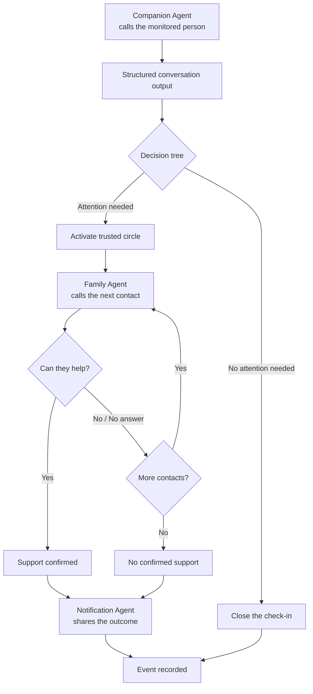
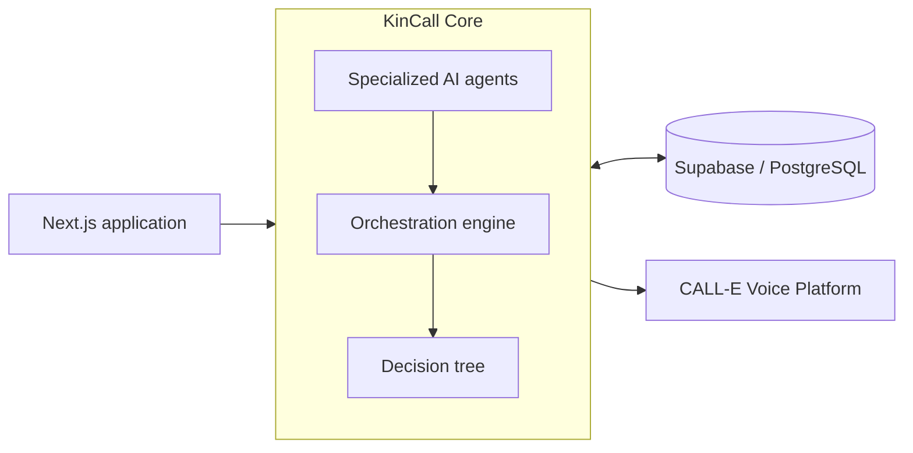

<p align="center">
  
</p>

<h1 align="center">KinCall</h1>

<p align="center">
  <strong>AI voice agents that turn every check-in into coordinated human support.</strong>
</p>

<p align="center">
  
  
  
  
</p>

<p align="center">
  Built for <strong>CALL-E: Your Code Is Calling</strong>.
</p>

---

## Overview

KinCall is an AI-powered phone check-in and family coordination system.

Specialized voice agents talk with the monitored person, understand what was said, and return structured information. An orchestration engine then follows a clear decision tree to close the check-in or contact the person’s trusted circle.

> **Agents understand the conversation. KinCall orchestrates the response.**

KinCall is not a medical device or an emergency service.

---

## The idea

Older adults, people living with chronic illness, and people with reduced mobility can easily become isolated, especially when family members live far away or cannot check in every day. Even when something is wrong, they may hesitate to call for help because they do not want to worry their relatives or feel like a burden.

KinCall provides a simple and reassuring safety net. It regularly calls the monitored person, has a warm and natural conversation, and identifies whether support may be needed. When help is requested or the situation is unclear, KinCall contacts the trusted circle in a predefined order until someone confirms they can assist. It then calls the monitored person back to explain the outcome.

The goal is not to replace human relationships, but to make sure that silence, uncertainty, or a quiet request for help never goes unnoticed.

---

## How it works

1. A **Companion Agent** calls the monitored person.
2. The conversation becomes a factual structured output.
3. The **Decision Engine** evaluates the result.
4. When attention is needed, **Family Agents** contact the trusted circle.
5. The cascade stops when someone confirms they can help or nobody is available.
6. A **Notification Agent** calls the monitored person back with the outcome.
7. The full event is recorded in the dashboard.



---

## Agent system

KinCall uses three specialized voice agents.

| Agent | Role |
|---|---|
| **Companion Agent** | Conducts the check-in and converts the conversation into structured facts. |
| **Family Agent** | Contacts a trusted person and asks whether they can help with the specific situation. |
| **Notification Agent** | Calls the monitored person back and communicates the final outcome. |

The agents interpret natural language, but they do not control the workflow.

Operational decisions remain inside KinCall’s orchestration engine.

---

## From conversation to action

The Companion Agent may return:

```json
{
  "person_reached": "yes",
  "explicit_help_requested": "yes",
  "neutral_summary": "Claire would like help completing an administrative document."
}
```

The decision engine then applies a rule:

```text
explicit_help_requested = yes
            │
            ▼
    ATTENTION_REQUIRED
            │
            ▼
Activate trusted-circle cascade
```

The AI interprets the conversation.

The decision tree transforms that interpretation into a controlled action.

---

## Context propagation

KinCall preserves the specific context throughout the full workflow.

```text
Claire:

“I need help completing an administrative document.”
```

The Family Agent receives:

```text
“Claire told KinCall that she would like help completing
an administrative document.”
```

Trusted contacts do not receive a vague message such as:

```text
“Claire needs help.”
```

The same factual context is shared with every contact involved in the event.

This works with new situations without hardcoded scenarios.

---

## Trusted-circle orchestration

When attention is required, contacts are reached one at a time.

```text
Julie
  │
  ├── Confirms support → stop the cascade
  │
  └── Declines / no answer
                    │
                    ▼
                  Marc
                    │
                    ├── Confirms support → stop the cascade
                    │
                    └── Declines / no answer
                                      │
                                      ▼
                                  Next contact
```

The orchestration engine manages:

- contact priority;
- availability;
- consent;
- retry limits;
- confirmed commitments;
- unresolved outcomes;
- the final callback.

---

## Core features

| Feature | Description |
|---|---|
| **AI voice agents** | Three specialized agents manage the complete phone workflow. |
| **Structured outputs** | Conversations become validated facts and factual summaries. |
| **Decision tree** | Explicit rules transform conversation results into workflow actions. |
| **Trusted-circle cascade** | Contacts are called sequentially until support is confirmed. |
| **Context-aware calls** | Every trusted contact receives the relevant context from the original conversation. |
| **Availability-aware ordering** | Available contacts can be prioritized without excluding the rest of the circle. |
| **Bounded retries** | Call attempts follow clear and controlled limits. |
| **Outcome callback** | The monitored person receives a final call with the result. |
| **Intervention summary** | KinCall records who offered to help, how and when. |
| **No confirmed support** | Unresolved situations remain clearly visible. |
| **Dashboard and history** | Profiles, activity, timelines and outcomes are available in one interface. |
| **Reliable orchestration** | Duplicate processing cannot create duplicate workflow actions. |

> [!NOTE]
> Schedule preferences are already stored and displayed. Automatic scheduled check-ins are not yet enabled.

---

## Architecture

KinCall combines conversational AI with a controlled orchestration layer.



```text
Phone conversation
        │
        ▼
AI interpretation
        │
        ▼
Structured output
        │
        ▼
Decision tree
        │
        ▼
Orchestrated action
```

---

## Technology stack

| Layer | Technology |
|---|---|
| Frontend | Next.js 16, React 19 |
| Language | TypeScript 5 |
| Styling | Tailwind CSS v4 |
| Voice agents | CALL-E |
| Orchestration | State machine and decision tree |
| Database | Supabase / PostgreSQL |
| Testing | Vitest |
| Runtime | Node.js |

---

## Repository

One Next.js application, organized so the architecture is visible from the tree:
`src/app/` routes, `src/frontend/` renders, `src/backend/` decides, `src/shared/` is used by both.

| Path | Purpose |
|---|---|
| [`src/app/`](src/app/) | Next.js pages and thin API entry points |
| [`src/frontend/`](src/frontend/) | Design system and product UI components |
| [`src/backend/`](src/backend/) | Agents, orchestration, integrations and persistence |
| [`src/shared/`](src/shared/) | Domain types, validation and pure formatting |
| [`tests/`](tests/) | Orchestration, agent, UI and regression coverage |
| [`supabase/`](supabase/) | PostgreSQL migrations and database tooling |
| [`docs/`](docs/) | Product, architecture, decisions and demo material |

Where the important pieces live:

| What | Where |
|---|---|
| Companion / Family / Notification agents | [`src/backend/agents/`](src/backend/agents/) |
| Decision tree | [`src/backend/orchestration/decision-tree.ts`](src/backend/orchestration/decision-tree.ts) |
| Orchestration engine | [`src/backend/orchestration/engine.ts`](src/backend/orchestration/engine.ts) |
| Event states and transitions | [`src/backend/orchestration/state-machine/`](src/backend/orchestration/state-machine/) |
| Trusted-circle cascade | [`src/backend/orchestration/cascade/`](src/backend/orchestration/cascade/) |
| CALL-E integration | [`src/backend/integrations/calle/`](src/backend/integrations/calle/) |
| Persistence | [`src/backend/persistence/`](src/backend/persistence/) |

---

## Getting started

### Prerequisites

- Node.js `^20.9.0 || >=22.0.0`
- npm
- A Supabase project
- A CALL-E account — only needed to place real calls

### Installation

```bash
git clone <your-repository-url>
cd kincall

npm install
cp .env.example .env.local
npm run dev
```

Open:

```text
http://localhost:3000
```

### Database

Set `KINCALL_PERSISTENCE=supabase`, `SUPABASE_URL` and `SUPABASE_SERVICE_ROLE_KEY` in
`.env.local`, then apply the schema:

```bash
npx supabase link --project-ref <your-project-ref>
npx supabase migration list
npx supabase db push
```

The migrations seed one demo profile and its trusted circle. Their stored numbers are
reserved-for-fiction numbers that KinCall refuses to dial, so the application is safe to
explore before any real number exists anywhere.

### Placing a real call safely

Real calls are opt-in and cannot happen by accident.

1. **Enable live mode explicitly.** Set `CALLE_MODE=live` and provide `CALLE_API_KEY`.
   Without both, no outbound call is ever placed.
2. **Use your own number, with consent.** Create a profile and trusted contacts through the
   interface, or override a stored number with `KINCALL_PHONE_<ENTITY_ID>` (the id
   uppercased, non-alphanumerics as underscores — `contact_sophie` →
   `KINCALL_PHONE_CONTACT_SOPHIE`). Only call people who have agreed to be called.
3. **A profile must have confirmed consent**, or KinCall refuses to call it — in every mode.
4. **Reserved-for-fiction numbers are rejected** before any request leaves the process, so a
   half-configured profile fails loudly instead of dialling a stranger.

> [!WARNING]
> Live calls consume CALL-E credit and ring a real phone. Keep `CALLE_MODE` unset while
> exploring the interface, the dashboard or the test suite — none of them need it.

Test data created for a live run can be archived afterwards:

```bash
node --env-file=.env.local scripts/cleanup-live-test-data.ts           # dry run
node --env-file=.env.local scripts/cleanup-live-test-data.ts --confirm
```

### Quality checks

```bash
npm run typecheck
npm test
npm run build
```

---

## Testing

KinCall currently includes **970 passing automated tests**.

The test suite covers:

- decision-tree rules;
- agent structured outputs;
- trusted-circle orchestration;
- contact ordering;
- retry policies;
- context propagation;
- outcome callbacks;
- concurrent processing;
- workflow recovery;
- scheduling calculations;
- dashboard logic.

---

## Safety and limitations

- KinCall is not an emergency service.
- KinCall does not diagnose or perform medical triage.
- KinCall never contacts emergency services.
- A confirmed intervention is a commitment, not proof that it happened.
- Automatic scheduled calls are not implemented yet.
- Call delivery time depends on CALL-E and the telephone carrier.
- Voicemail cannot always be identified reliably.
- Authentication and additional security are required before public deployment.
  
---

## Documentation

- [`Product specification`](docs/PRODUCT_SPECIFICATION.md)
- [`Technical architecture`](docs/TECHNICAL_ARCHITECTURE.md)
- [`Decision log`](docs/DECISION_LOG.md)
- [`Demo walkthrough`](docs/DEMO.md)

---

## CALL-E hackathon

KinCall is an independent submission for
[CALL-E: Your Code Is Calling](https://call-e.devpost.com/), an ongoing hackathon focused on AI agents that make real phone calls and complete real-world tasks.

KinCall is not affiliated with, endorsed by or sponsored by CALL-E.
