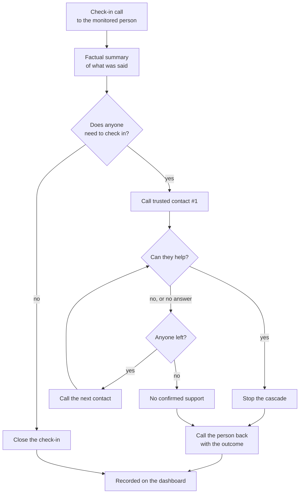
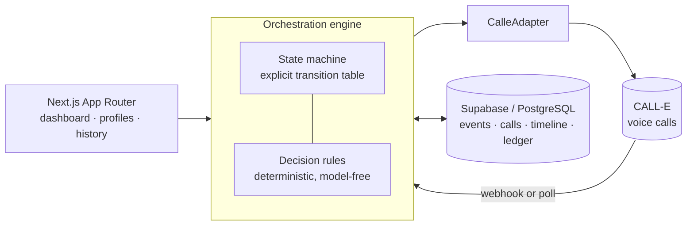

<h1 align="center">KinCall</h1>

<p align="center">
  <strong>A familiar phone call, watching over the people you love.</strong>
</p>

<p align="center">
  
  
  
  
  
</p>

---

## Overview

KinCall places a check-in phone call to a monitored person. A voice agent has an ordinary
conversation and returns a constrained, factual summary. Deterministic TypeScript rules —
not a model — then decide one of two things: close the check-in, or contact the trusted
circle. If the circle is contacted, KinCall works down it in order, retrying within a
bounded policy, until somebody confirms they can help or the circle is exhausted. Either
way it calls the monitored person back with the outcome, and the whole sequence is recorded
on a dashboard the family can read.

KinCall is **not** a medical device and **not** an emergency service. It never diagnoses,
never rates severity, and never contacts emergency services.

---

## The problem

When someone lives alone, the people who care about them improvise a rota of phone calls.
It works until it doesn't: everyone assumes someone else called today, a worrying remark
reaches one person and not the others, and when something does come up, the scramble to
find whoever is free and nearby starts from scratch.

The hard part was never the phone call. It is the coordination around it — noticing what
was said, deciding it warrants reaching the family, working through the circle in a
sensible order, and closing the loop with the person who raised it. KinCall does that part
the same way every time, and writes down what it did.

---

## How it works

1. KinCall calls the monitored person.
2. The conversation is summarized factually.
3. Deterministic rules decide whether anyone needs to check in.
4. The trusted circle is contacted in order, one contact at a time.
5. A contact confirms, or the circle is exhausted.
6. KinCall calls the monitored person back with the outcome.
7. The dashboard records the full history.



---

## Features

| | |
|---|---|
| **Context propagation** | What the person actually said reaches every trusted contact — "help completing an administrative document", not just "asked for help". Generalizes to any situation; nothing is hardcoded. |
| **Deterministic cascade** | Contacts called in configured order, one at a time, with bounded retries and no model in the decision path. |
| **Retries and availability** | Exactly one retry per contact and one for the monitored person. Availability windows re-order who is tried first; nobody is ever excluded by them. |
| **Primary contact** | At most one per circle, enforced in the database. Informational — it never bypasses consent or retry rules. |
| **Schedules** | Days, time and timezone per person, with the next planned check-in computed and displayed. |
| **Informational callback** | One call back to the monitored person after the outcome — never retried, never able to change the outcome. |
| **Intervention summaries** | Who committed to what and roughly when, always with an explicit "KinCall has not verified this took place" caveat. |
| **Unresolved outcomes** | An exhausted circle ends visibly as *No confirmed support*, never as a silent close and never waiting on a human. |
| **Dashboard and history** | Daily recap per person, operational metrics, a filterable calendar and per-event timelines. |
| **Crash recovery** | An operation ledger, call intents and processing leases: a crash, a duplicate webhook or two workers cannot duplicate a call. |
| **Accessibility** | Keyboard-operable controls, visible focus, semantic markup and reduced-motion support. No formal WCAG audit is claimed. |
| **925 automated tests** | Orchestration, crash recovery, concurrency, prompts and presentation. |

> [!NOTE]
> There is no automatic production scheduler. Schedules are stored and displayed; a
> check-in is started from a profile page.

---

## Architecture

The orchestration engine is deliberately boring: plain TypeScript, an explicit
state-transition table, and no model anywhere in the decision path. CALL-E sits behind an
adapter interface.



A call returns immediately as *queued*; the terminal result arrives later, by signed
webhook in a deployment or by a poll endpoint the event page drives. Both run the identical
orchestration code.

Every transition is written with an operation key, so a replay is a no-op rather than a
duplicate. Every outbound call is written as an *intent* before the request leaves, so a
crash can never leave a placed call KinCall cannot find. Every terminal result is processed
under a time-bounded lease, so two workers cannot both act on it.

---

## Technology stack

| Layer | Choice |
|---|---|
| Framework | Next.js 16 (App Router), React 19 |
| Language | TypeScript 5, strict |
| Styling | Tailwind CSS v4 |
| Database | Supabase (PostgreSQL), RLS forced, service-role only |
| Voice | CALL-E REST API behind a `CalleAdapter` interface |
| Tests | Vitest |
| Runtime | Node `^20.9.0 \|\| >=22.0.0` |

---

## Project structure

```
app/
  (marketing)/        Landing page
  (app)/              Dashboard, profiles, trusted circles, history, events
  api/                Event start, poll, webhook, people and contact routes
  ui/                 Design-system primitives and the KinCall mark
lib/
  orchestration/      State machine, engine, decision rules, context briefs
  calle/              Adapter interface and result schemas
  database/           Repository interface and drivers
  presentation/       Human-readable labels and summaries
  schedule/           Deterministic next-check-in computation
prompts/              Companion, Family and notification agent prompts
supabase/migrations/  0001 – 0014
tests/                925 tests
docs/                 Product specification, technical architecture, decision log
```

---

## Getting started

**Prerequisites** — Node `^20.9.0 || >=22.0.0` and npm.

```bash
git clone <your-repository-url>
cd kincall
npm install
cp .env.example .env.local
npm run dev            # http://localhost:3000
```

**Persistence.** Set `KINCALL_PERSISTENCE=supabase`, `SUPABASE_URL` and
`SUPABASE_SERVICE_ROLE_KEY` in `.env.local`, then apply the schema:

```bash
npx supabase link --project-ref <your-project-ref>
npx supabase migration list        # local and remote should match
npx supabase db push --dry-run     # preview
npx supabase db push               # apply
```

**Checks:**

```bash
npm run typecheck
npm test
npm run build
```

---

## Environment variables

All values below are placeholders. Never commit a real key or a real phone number —
`.env.local` is git-ignored, and `.env.example` is the documented template.

| Variable | Purpose |
|---|---|
| `CALLE_MODE` | Selects the CALL-E adapter. Only `live` places real calls. |
| `KINCALL_PERSISTENCE` | `memory` (default) or `supabase`. |
| `SUPABASE_URL` | Project URL. Server-only — never `NEXT_PUBLIC_`. |
| `SUPABASE_SERVICE_ROLE_KEY` | Service-role key. Bypasses RLS; server-only. |
| `KINCALL_PROCESSING_LEASE_SECONDS` | Lease duration; set at or above your platform's function timeout. |
| `CALLE_API_KEY` | API key. Required when `CALLE_MODE=live`. |
| `CALLE_BASE_URL` | API base URL. Defaults to CALL-E's public endpoint. |
| `CALLE_WEBHOOK_URL` | Public HTTPS URL of `/api/webhooks/calle`. |
| `CALLE_WEBHOOK_SECRET` | Signing secret used to verify inbound webhooks. |
| `KINCALL_PHONE_<ID>` | Optional per-entity override of a stored number. |
| `KINCALL_TIMING` | Set to `1` to print stage timings — an event id, a stage name and a duration, never call content. |

---

## Testing

```bash
npm test               # 925 tests
npm run test:watch
npm run test:integration   # opt-in; requires a disposable Supabase project
```

The suite covers the deterministic state machine and every transition; the trusted-circle
cascade, contact ordering and retry bounds; crash recovery at each await boundary, with
convergence on one timeline; concurrency and lease handling; idempotency against duplicate
webhooks and polls; consent, archival and phone-safety rules; prompt composition and
context propagation; and presentation helpers.

This is a large regression suite, not a proof: no formal verification is claimed.

---

## Safety and limitations

- **KinCall is not an emergency service.** It never contacts emergency services, and the
  agents tell the person to call their local emergency number themselves if they believe it
  is needed.
- **KinCall does not diagnose.** No condition, no severity, no triage. The decision is
  operational and binary: close the check-in, or contact the trusted circle.
- **A confirmed intervention is a recorded commitment, not a verified action.** KinCall has
  no way to know whether a contact actually visited, and never claims otherwise.
- **No automatic scheduler.** Schedules are stored and displayed; a check-in is started
  manually.
- **Call latency is external.** The delay between CALL-E accepting a call and the phone
  ringing belongs to the provider and the carrier.
- **Voicemail cannot be reliably detected.** CALL-E exposes no answering-machine detection,
  so KinCall never claims a voicemail was left.
- **Mutating routes are unauthenticated** and need protection before any public deployment.

---

## Project status

The MVP works end to end, and controlled live tests have been carried out with a consenting
participant on a single controlled number.

Before a public production deployment this still needs: authentication and protection of the
mutating API routes; an automatic scheduler if unattended check-ins are wanted; a compliance
and data-protection review; and deployment hardening including webhook secret provisioning
and rate limiting.

Architecture decisions, including the ones that were rejected and why, are recorded in
[`docs/DECISION_LOG.md`](docs/DECISION_LOG.md). The frozen product scope is in
[`docs/PRODUCT_SPECIFICATION.md`](docs/PRODUCT_SPECIFICATION.md) and the technical baseline
in [`docs/TECHNICAL_ARCHITECTURE.md`](docs/TECHNICAL_ARCHITECTURE.md).

---

## Origin

KinCall began during the CALL-E hackathon and has continued as an independent product
project. It is not affiliated with, endorsed by, or sponsored by CALL-E or any other
organisation.
